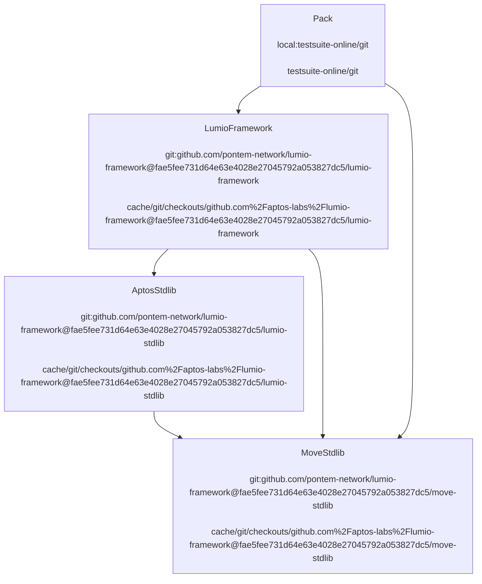

success

```mermaid
flowchart TD
    N0["Pack<br><br>local:testsuite-online/git<br><br>testsuite-online/git"]
    N1["LumioFramework<br><br>git:github.com/pontem-network/lumio-framework@fae5fee731d64e63e4028e27045792a053827dc5/lumio-framework<br><br>cache/git/checkouts/github.com%2Faptos-labs%2Flumio-framework@fae5fee731d64e63e4028e27045792a053827dc5/lumio-framework"]
    N2["AptosStdlib<br><br>git:github.com/pontem-network/lumio-framework@fae5fee731d64e63e4028e27045792a053827dc5/lumio-stdlib<br><br>cache/git/checkouts/github.com%2Faptos-labs%2Flumio-framework@fae5fee731d64e63e4028e27045792a053827dc5/lumio-stdlib"]
    N3["MoveStdlib<br><br>git:github.com/pontem-network/lumio-framework@fae5fee731d64e63e4028e27045792a053827dc5/move-stdlib<br><br>cache/git/checkouts/github.com%2Faptos-labs%2Flumio-framework@fae5fee731d64e63e4028e27045792a053827dc5/move-stdlib"]
    N2 --> N3
    N1 --> N2
    N1 --> N3
    N0 --> N1
    N0 --> N3

```
